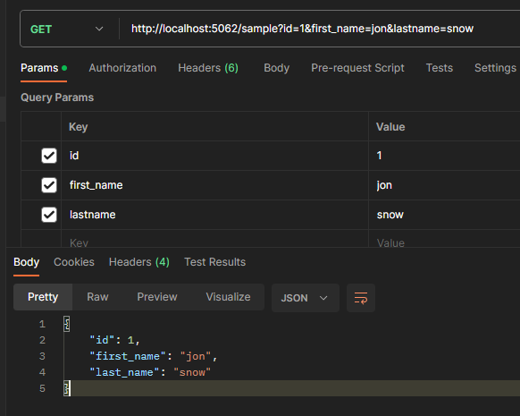

# Custom Naming Parameters Api (Release version coming soon)
Auto rename parameter format to SnakeCase only

# Step - 1 : Register service for rename parameters in Program.cs
```cs
builder.Services.AddNamingSnakeCaseRequest();
```

# Step - 2 : Use Attribute for reanme parameters. 
Example file : Controllers/SampleController.cs
```cs
 [ApiController, Route("sample")]
 public class SampleController : ControllerBase
 {
     [HttpGet]
     public IActionResult Get([FromQuery] SampleRequest request) => Ok(request);

     [HttpPost]
     public IActionResult Post([FromForm] SamplePostRequest request) => Ok(request);
 }

 public class SampleRequest
 {
     public int Id { get; set; }

     [FromQuery(Name = "first_name")]
     public string FirstName { get; set; }
     public string LastName { get; set; }
 }

 [SnakeCaseObject]
 public class SamplePostRequest
 {
     public string FirstName { get; set; }
     public string LastName { get; set; }
     public DateTime? Birthday { get; set; }
 }
```
### Request, Response - With FromQuery



### Request, Response - With FromForm
